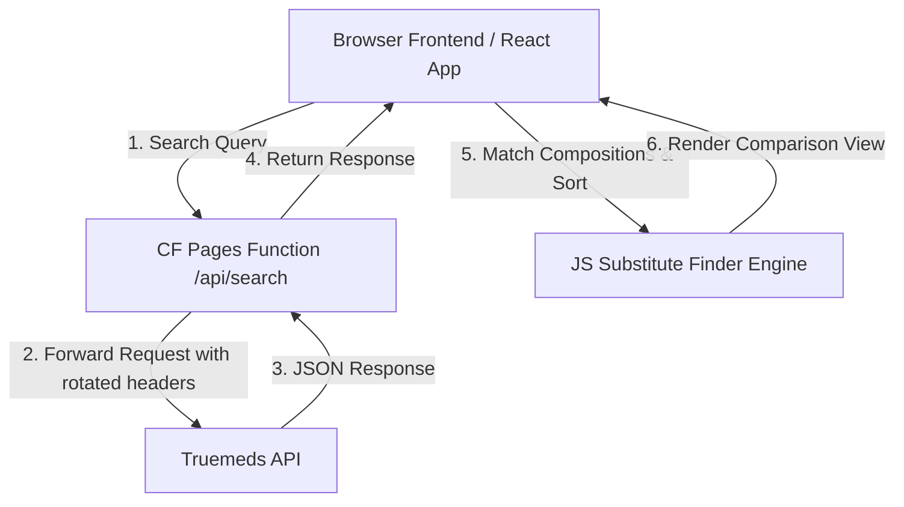
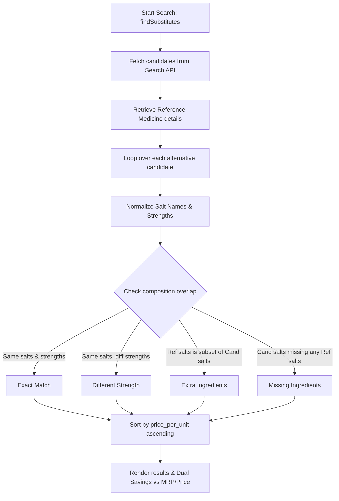

# Medicine Substitute Portal

A premium, highly interactive dynamic mobile-first web portal built with **React + Vite + Tailwind CSS v3** directly at the root level of the workspace. It is hosted as a static site on Cloudflare Pages.

## Table of Contents
1. [Architecture](#architecture)
2. [Directory Structure](#directory-structure)
3. [Local Storage Schema](#local-storage-schema)
4. [Testing Suite](#testing-suite)
5. [CORS Proxy Setup](#cors-proxy-setup)
6. [Deployment](#deployment)

---

## Architecture

### System Flow Diagram


All search, parsing, composition comparison, and sorting logic is ported from the original Python script into client-side JavaScript.
If CORS prevents direct browser calls to the Truemeds API, a serverless Cloudflare Pages Function is implemented under `/functions/api/search.js` as an API proxy.

### Key Specifications:
- **Framework & Build Stack**: React + Vite + Tailwind CSS v3
- **Mobile-First Design**: Highly responsive, touch-friendly UI. Mobile view uses card layouts or collapsing accordions instead of wide tables.
- **Search History**: Persisted in browser's `localStorage` and displayed in a "Recent Searches" panel/sidebar.
- **URL Search Parameters**: Automatically detects and parses `?search=query` or `?q=query` on mount to trigger search.
- **Offline Fixtures**: JSON reports are stored under `/public/data/` for offline/fallback mode.

---

## Medicine Discovery & Matching Logic

### Logic Flow Diagram


### Exact Core Matching & Classification Details:
1. **Candidate Retrieval**: Fetches brand matching and auto-suggestions from Truemeds' search API. 
2. **Salt Composition Extraction**: Extract key elements from `composition` strings (or the structured `saltComposition` payload) using pattern matching regexes.
3. **Normalization**:
   * **Name**: Trimmed and converted to lowercase (e.g. `Polyethylene Glycol` ➡️ `polyethylene glycol`).
   * **Strength**: Normalizes concentrations, removing spaces, converting units like `i.u.` to `iu`, and handling large number formats cleanly (e.g., `0.3 %` ➡️ `0.3%`).
4. **Matching Classification**:
   * **Exact Match**: The candidate contains the exact same list of normalized salts in the exact same strengths.
   * **Different Strength**: The candidate contains the exact same list of normalized salts, but at least one salt has a different strength.
   * **Extra Ingredients**: The reference medicine's salts list is a proper subset of the candidate's salts (meaning the candidate contains all reference salts plus some additional ones).
   * **Missing Ingredients**: The candidate lacks one or more of the reference medicine's salts.
5. **Sorting & Dual Savings**:
   * Alternatives are sorted by `price_per_unit` in ascending order.
   * Savings are calculated relative to both the **Reference MRP** (retail) and **Reference Price** (Truemeds selling price).
   * If a product is more expensive, the savings percentage resolves to a negative value shown as a surcharge (e.g., `+24% Cost`).

---

## Directory Structure
```
/ (Root)
├── index.html                  # Main HTML entry point
├── package.json                # Project dependencies and run scripts
├── vite.config.js              # Vite build config
├── tailwind.config.js          # Tailwind CSS v3 styling config
├── postcss.config.js           # PostCSS configuration
├── functions/
│   └── api/
│       └── search.js           # Cloudflare Serverless Function (Proxy)
├── src/
│   ├── main.jsx                # React Entry point
│   ├── App.jsx                 # Core Application layout & controller
│   ├── index.css               # Base CSS including Tailwind imports
│   ├── components/             # React modular UI components
│   │   ├── AlternativeCard.jsx # Mobile-responsive match card (individual)
│   │   ├── Header.jsx          # App navigation header
│   │   ├── MatchFilters.jsx    # Filters (Exact, Diff Strength, Partial)
│   │   ├── ResponsiveLayout.jsx # Grid container layout
│   │   ├── SwapWalkthrough.jsx # Interactive 3-step timeline wizard
│   │   ├── MobileAlternativeStack.jsx # Responsive collapsible accordion-like card stack
│   │   ├── DesktopComparisonTable.jsx # Responsive table layout
│   │   └── SearchBar/
│   │       ├── HistoryList.jsx # Sidebar search history dropdown list
│   │       └── SearchInput.jsx # Input box with dynamic auto-trigger search on typing/select
│   ├── js/
│   │   └── substitute-finder.js # Ported JS comparison engine
│   └── tests/                  # Complete Test Suite (Vitest)
│       ├── unit/               # Unit tests (substitute finder, storage, client)
│       ├── component/          # Component/Unit rendering tests
│       ├── integration/        # Routing, search flows, history flows
│       └── parity/             # Dynamic parity tests against Python CLI
│       └── setup.js            # Mock environment setup
└── tests/
    └── parity-tests.js         # Dedicated standalone pilot brand verification test runner
```

---

## Local Storage Schema
Recent search history is stored under two keys:
1. `tm_search_history`: list of search query strings used in the App components:
```json
[
  "ecosprin 75 tablet 14",
  "pan 40 tablet 15"
]
```
2. `truemeds_search_history`: structured log of queries containing detailed medicine information recorded by `useSubstituteFinder`:
```json
[
  {
    "query": "Ecosprin 75",
    "name": "Ecosprin 75 Tablet 14",
    "price": 5.2,
    "mrp": 6.5,
    "timestamp": "2026-06-27T12:00:00.000Z"
  }
]
```

---

## Testing Suite
The portal has a comprehensive 4-tier testing suite utilizing **Vitest** and **React Testing Library**:
- **Tier 0**: Cloudflare Worker Proxy tests
- **Tier 1**: Unit tests (`substitute-finder.test.js`, `search-history.test.js`, `api-client.test.js`)
- **Tier 2**: Component tests (`SearchBar.test.jsx`, `AlternativeCard.test.jsx`, etc.)
- **Tier 3**: Integration flow tests (`search-flow.test.jsx`, `history-flow.test.jsx`)
- **Tier 4**: Parity tests (`dynamic-parity.test.js`) comparing JS outputs with Python Markdown outputs.

### Running Tests
To run all tests in the suite:
```bash
npx vitest run
```

---

## CORS Proxy Setup
If live CORS issues arise, requests are automatically routed to the Cloudflare Serverless Function proxy at `/api/search` which forwards request to:
`https://nal.tmmumbai.in/v1/`
