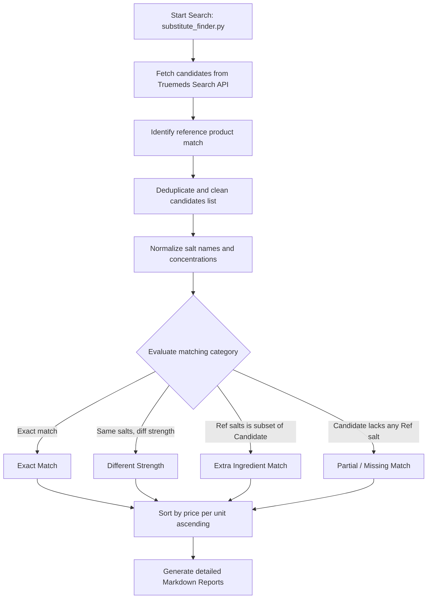

# Python CLI Medicine Substitute Finder

The original, production-grade CLI utility written in Python for fetching and identifying medicine substitutes, matching composition salts, and exporting clean markdown reports.

## Architecture & Logic Flow


## Medicine Discovery & Matching Logic
1. **Candidate Retrieval & Deduplication**: Fetches options from the Truemeds Search API. We filter out duplicate product codes, keeping only the entry with the lowest unit cost.
2. **Name & Salt Normalization**:
   * All names are lowercased and trimmed.
   * Ingredient compositions are parsed and mapped to their respective concentration quantities.
3. **Strength Normalization**:
   * Formats are standardized to allow direct numeric comparisons (e.g., standardizing percent symbols, units, and spaces).
   * **Probiotic Spores/Cells**: Handles complex inputs like `1 B`, `1.25 Billion Cells`, `15 Billion spores`, converting them to standard units to prevent false mismatched strengths.
4. **Matching Classification**:
   * **Exact Match**: The candidate contains the exact same list of normalized salts in the exact same strengths.
   * **Different Strength**: The candidate contains the exact same list of normalized salts, but at least one salt has a different strength.
   * **Extra Ingredients**: The reference medicine's salts list is a proper subset of the candidate's salts (meaning the candidate contains all reference salts plus some additional ones).
   * **Missing Ingredients**: The candidate lacks one or more of the reference medicine's salts.
5. **Report Generation**: Outputs a structured report listing comparisons, instructions on how to swap, and savings relative to the reference medicine's MRP.

---

## Installation & Setup
Requires Python 3.8+.

```bash
# Navigate to the python directory
cd python

# Run the script directly
python3 substitute_finder.py "<query>"
```

---

## Execution
To generate substitute reports:
```bash
python3 substitute_finder.py "Ecosprin 75"
```
This will fetch suggestions and ingredients from Truemeds API, perform alignment checks, and generate a markdown report under the root directory: `ecosprin_75_tablet_14_substitutes.md`.

---

## Mock/Offline Mode (Tests)
To run the python script using offline mock JSON files (fixtures):
```bash
MOCK_FIXTURE_DIR="ecosprin_75_tablet_14" python3 substitute_finder.py "Ecosprin 75"
```
This forces the script to read payloads from `src/tests/fixtures/api/ecosprin_75_tablet_14/` instead of executing remote network requests.
